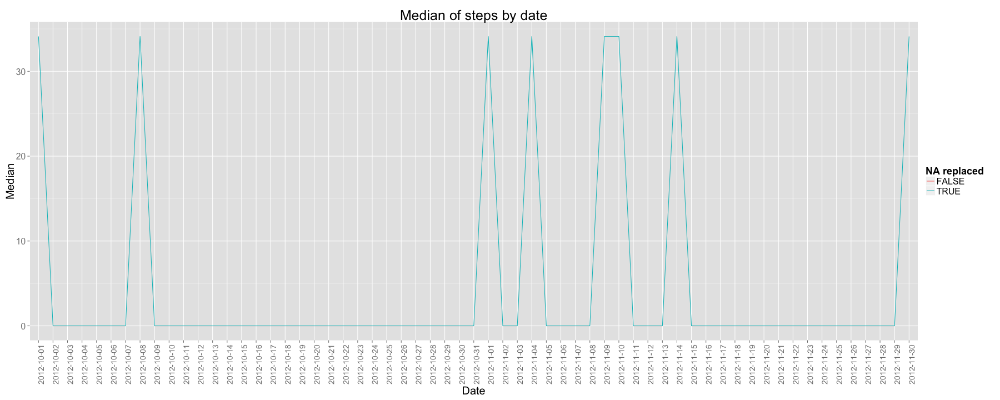

SCRIPT: PA1_template.Rmd

AUTHOR: Isabel M. Izquierdo Martin (imim)

DATE: 10/19/2014

OUTPUT: PA1_template.md, PA1_template.html files plus figure directory with the images 

PURPOSE: Report answering some questions about "activity" data

DATA SOURCE: https://d396qusza40orc.cloudfront.net/repdata%2Fdata%2Factivity.zip

INPUT DATA: activity.csv, after unzipped them from the data source

LIMITATIONS: activity.csv, and the current R Markdown Script must be in the working directory

EXECUTION: processing the R markdown file with knit2html() function in R
             (from the knitr package) by running the function from the console:
             knit2html("PA1_template.Rmd", "PA1_template.html", options="")
             knit2html("PA1_template.Rmd", "PA1_template.md", options="")

# Loading and preprocessing the data

```r
Sys.setlocale("LC_TIME", "en_US.UTF-8") 
```


```r
InputDataNoNA <- read.csv("activity.csv")
InputDataNoNA$date <- as.Date(InputDataNoNA$date)

# In order to print tables in the report
library(xtable)
TableInputData <- xtable(summary(InputDataNoNA))
print(TableInputData, type = "html")
```

<!-- html table generated in R 3.1.1 by xtable 1.7-4 package -->
<!-- Sun Oct 19 20:35:02 2014 -->
<table border=1>
<tr> <th>  </th> <th>     steps </th> <th>      date </th> <th>    interval </th>  </tr>
  <tr> <td align="right"> 1 </td> <td> Min.   :  0.00   </td> <td> Min.   :2012-10-01   </td> <td> Min.   :   0.0   </td> </tr>
  <tr> <td align="right"> 2 </td> <td> 1st Qu.:  0.00   </td> <td> 1st Qu.:2012-10-16   </td> <td> 1st Qu.: 588.8   </td> </tr>
  <tr> <td align="right"> 3 </td> <td> Median :  0.00   </td> <td> Median :2012-10-31   </td> <td> Median :1177.5   </td> </tr>
  <tr> <td align="right"> 4 </td> <td> Mean   : 37.38   </td> <td> Mean   :2012-10-31   </td> <td> Mean   :1177.5   </td> </tr>
  <tr> <td align="right"> 5 </td> <td> 3rd Qu.: 12.00   </td> <td> 3rd Qu.:2012-11-15   </td> <td> 3rd Qu.:1766.2   </td> </tr>
  <tr> <td align="right"> 6 </td> <td> Max.   :806.00   </td> <td> Max.   :2012-11-30   </td> <td> Max.   :2355.0   </td> </tr>
  <tr> <td align="right"> 7 </td> <td> NA's   :2304   </td> <td>  </td> <td>  </td> </tr>
   </table>

# What is mean total number of steps taken per day?
For this part of the assignment, the missing values in the dataset are ignored.

```r
# For clarity, removing row.names column
row.names(InputDataNoNA) <- NULL
```
The dataframe's name (InputDataNoNA) makes reference to the fact that missing values has not been replaced.

## Make a histogram of the total number of steps taken each day

```r
# In order to make plots
library(ggplot2)
ggplot(InputDataNoNA, aes(x=as.factor(date), y=as.numeric(steps))) + 
        xlab("Date") + ylab("Steps") + 
        theme(axis.text.x = element_text(angle=90, hjust=1, size=16)) +
        theme(axis.text.y = element_text(size=16)) +
        theme(plot.title = element_text(size = 25)) +
        theme(axis.title.x = element_text(size = 20)) +
        theme(axis.title.y = element_text(size = 20)) +
        ggtitle ("Total number of steps taken each date") + 
        geom_bar(stat="identity", fill="lightblue")
```

```
## Warning: Removed 2304 rows containing missing values (position_stack).
```

 

## Calculate and report the mean and median total number of steps taken per day

```r
# In order to use tapply, sapply
library(plyr)
mean <- tapply(InputDataNoNA$steps,InputDataNoNA$date, mean, na.rm=TRUE)
median <- tapply(InputDataNoNA$steps,InputDataNoNA$date, mean, na.rm=TRUE)
mean <- as.data.frame(mean)
median <- as.data.frame(median)
DataMeanMedian <- as.data.frame(c(mean,median))
DataMeanMedian$date <- rownames(DataMeanMedian)
DataMeanMedianNoNA <- DataMeanMedian

row.names(DataMeanMedianNoNA) <- NULL
DataMeanMedianNoNA <- DataMeanMedianNoNA[, c("date","mean","median")]

TableMeanMedian <- xtable(DataMeanMedianNoNA)
print(TableMeanMedian, type = "html")
```

<!-- html table generated in R 3.1.1 by xtable 1.7-4 package -->
<!-- Sun Oct 19 20:35:03 2014 -->
<table border=1>
<tr> <th>  </th> <th> date </th> <th> mean </th> <th> median </th>  </tr>
  <tr> <td align="right"> 1 </td> <td> 2012-10-01 </td> <td align="right">  </td> <td align="right">  </td> </tr>
  <tr> <td align="right"> 2 </td> <td> 2012-10-02 </td> <td align="right"> 0.44 </td> <td align="right"> 0.44 </td> </tr>
  <tr> <td align="right"> 3 </td> <td> 2012-10-03 </td> <td align="right"> 39.42 </td> <td align="right"> 39.42 </td> </tr>
  <tr> <td align="right"> 4 </td> <td> 2012-10-04 </td> <td align="right"> 42.07 </td> <td align="right"> 42.07 </td> </tr>
  <tr> <td align="right"> 5 </td> <td> 2012-10-05 </td> <td align="right"> 46.16 </td> <td align="right"> 46.16 </td> </tr>
  <tr> <td align="right"> 6 </td> <td> 2012-10-06 </td> <td align="right"> 53.54 </td> <td align="right"> 53.54 </td> </tr>
  <tr> <td align="right"> 7 </td> <td> 2012-10-07 </td> <td align="right"> 38.25 </td> <td align="right"> 38.25 </td> </tr>
  <tr> <td align="right"> 8 </td> <td> 2012-10-08 </td> <td align="right">  </td> <td align="right">  </td> </tr>
  <tr> <td align="right"> 9 </td> <td> 2012-10-09 </td> <td align="right"> 44.48 </td> <td align="right"> 44.48 </td> </tr>
  <tr> <td align="right"> 10 </td> <td> 2012-10-10 </td> <td align="right"> 34.38 </td> <td align="right"> 34.38 </td> </tr>
  <tr> <td align="right"> 11 </td> <td> 2012-10-11 </td> <td align="right"> 35.78 </td> <td align="right"> 35.78 </td> </tr>
  <tr> <td align="right"> 12 </td> <td> 2012-10-12 </td> <td align="right"> 60.35 </td> <td align="right"> 60.35 </td> </tr>
  <tr> <td align="right"> 13 </td> <td> 2012-10-13 </td> <td align="right"> 43.15 </td> <td align="right"> 43.15 </td> </tr>
  <tr> <td align="right"> 14 </td> <td> 2012-10-14 </td> <td align="right"> 52.42 </td> <td align="right"> 52.42 </td> </tr>
  <tr> <td align="right"> 15 </td> <td> 2012-10-15 </td> <td align="right"> 35.20 </td> <td align="right"> 35.20 </td> </tr>
  <tr> <td align="right"> 16 </td> <td> 2012-10-16 </td> <td align="right"> 52.38 </td> <td align="right"> 52.38 </td> </tr>
  <tr> <td align="right"> 17 </td> <td> 2012-10-17 </td> <td align="right"> 46.71 </td> <td align="right"> 46.71 </td> </tr>
  <tr> <td align="right"> 18 </td> <td> 2012-10-18 </td> <td align="right"> 34.92 </td> <td align="right"> 34.92 </td> </tr>
  <tr> <td align="right"> 19 </td> <td> 2012-10-19 </td> <td align="right"> 41.07 </td> <td align="right"> 41.07 </td> </tr>
  <tr> <td align="right"> 20 </td> <td> 2012-10-20 </td> <td align="right"> 36.09 </td> <td align="right"> 36.09 </td> </tr>
  <tr> <td align="right"> 21 </td> <td> 2012-10-21 </td> <td align="right"> 30.63 </td> <td align="right"> 30.63 </td> </tr>
  <tr> <td align="right"> 22 </td> <td> 2012-10-22 </td> <td align="right"> 46.74 </td> <td align="right"> 46.74 </td> </tr>
  <tr> <td align="right"> 23 </td> <td> 2012-10-23 </td> <td align="right"> 30.97 </td> <td align="right"> 30.97 </td> </tr>
  <tr> <td align="right"> 24 </td> <td> 2012-10-24 </td> <td align="right"> 29.01 </td> <td align="right"> 29.01 </td> </tr>
  <tr> <td align="right"> 25 </td> <td> 2012-10-25 </td> <td align="right"> 8.65 </td> <td align="right"> 8.65 </td> </tr>
  <tr> <td align="right"> 26 </td> <td> 2012-10-26 </td> <td align="right"> 23.53 </td> <td align="right"> 23.53 </td> </tr>
  <tr> <td align="right"> 27 </td> <td> 2012-10-27 </td> <td align="right"> 35.14 </td> <td align="right"> 35.14 </td> </tr>
  <tr> <td align="right"> 28 </td> <td> 2012-10-28 </td> <td align="right"> 39.78 </td> <td align="right"> 39.78 </td> </tr>
  <tr> <td align="right"> 29 </td> <td> 2012-10-29 </td> <td align="right"> 17.42 </td> <td align="right"> 17.42 </td> </tr>
  <tr> <td align="right"> 30 </td> <td> 2012-10-30 </td> <td align="right"> 34.09 </td> <td align="right"> 34.09 </td> </tr>
  <tr> <td align="right"> 31 </td> <td> 2012-10-31 </td> <td align="right"> 53.52 </td> <td align="right"> 53.52 </td> </tr>
  <tr> <td align="right"> 32 </td> <td> 2012-11-01 </td> <td align="right">  </td> <td align="right">  </td> </tr>
  <tr> <td align="right"> 33 </td> <td> 2012-11-02 </td> <td align="right"> 36.81 </td> <td align="right"> 36.81 </td> </tr>
  <tr> <td align="right"> 34 </td> <td> 2012-11-03 </td> <td align="right"> 36.70 </td> <td align="right"> 36.70 </td> </tr>
  <tr> <td align="right"> 35 </td> <td> 2012-11-04 </td> <td align="right">  </td> <td align="right">  </td> </tr>
  <tr> <td align="right"> 36 </td> <td> 2012-11-05 </td> <td align="right"> 36.25 </td> <td align="right"> 36.25 </td> </tr>
  <tr> <td align="right"> 37 </td> <td> 2012-11-06 </td> <td align="right"> 28.94 </td> <td align="right"> 28.94 </td> </tr>
  <tr> <td align="right"> 38 </td> <td> 2012-11-07 </td> <td align="right"> 44.73 </td> <td align="right"> 44.73 </td> </tr>
  <tr> <td align="right"> 39 </td> <td> 2012-11-08 </td> <td align="right"> 11.18 </td> <td align="right"> 11.18 </td> </tr>
  <tr> <td align="right"> 40 </td> <td> 2012-11-09 </td> <td align="right">  </td> <td align="right">  </td> </tr>
  <tr> <td align="right"> 41 </td> <td> 2012-11-10 </td> <td align="right">  </td> <td align="right">  </td> </tr>
  <tr> <td align="right"> 42 </td> <td> 2012-11-11 </td> <td align="right"> 43.78 </td> <td align="right"> 43.78 </td> </tr>
  <tr> <td align="right"> 43 </td> <td> 2012-11-12 </td> <td align="right"> 37.38 </td> <td align="right"> 37.38 </td> </tr>
  <tr> <td align="right"> 44 </td> <td> 2012-11-13 </td> <td align="right"> 25.47 </td> <td align="right"> 25.47 </td> </tr>
  <tr> <td align="right"> 45 </td> <td> 2012-11-14 </td> <td align="right">  </td> <td align="right">  </td> </tr>
  <tr> <td align="right"> 46 </td> <td> 2012-11-15 </td> <td align="right"> 0.14 </td> <td align="right"> 0.14 </td> </tr>
  <tr> <td align="right"> 47 </td> <td> 2012-11-16 </td> <td align="right"> 18.89 </td> <td align="right"> 18.89 </td> </tr>
  <tr> <td align="right"> 48 </td> <td> 2012-11-17 </td> <td align="right"> 49.79 </td> <td align="right"> 49.79 </td> </tr>
  <tr> <td align="right"> 49 </td> <td> 2012-11-18 </td> <td align="right"> 52.47 </td> <td align="right"> 52.47 </td> </tr>
  <tr> <td align="right"> 50 </td> <td> 2012-11-19 </td> <td align="right"> 30.70 </td> <td align="right"> 30.70 </td> </tr>
  <tr> <td align="right"> 51 </td> <td> 2012-11-20 </td> <td align="right"> 15.53 </td> <td align="right"> 15.53 </td> </tr>
  <tr> <td align="right"> 52 </td> <td> 2012-11-21 </td> <td align="right"> 44.40 </td> <td align="right"> 44.40 </td> </tr>
  <tr> <td align="right"> 53 </td> <td> 2012-11-22 </td> <td align="right"> 70.93 </td> <td align="right"> 70.93 </td> </tr>
  <tr> <td align="right"> 54 </td> <td> 2012-11-23 </td> <td align="right"> 73.59 </td> <td align="right"> 73.59 </td> </tr>
  <tr> <td align="right"> 55 </td> <td> 2012-11-24 </td> <td align="right"> 50.27 </td> <td align="right"> 50.27 </td> </tr>
  <tr> <td align="right"> 56 </td> <td> 2012-11-25 </td> <td align="right"> 41.09 </td> <td align="right"> 41.09 </td> </tr>
  <tr> <td align="right"> 57 </td> <td> 2012-11-26 </td> <td align="right"> 38.76 </td> <td align="right"> 38.76 </td> </tr>
  <tr> <td align="right"> 58 </td> <td> 2012-11-27 </td> <td align="right"> 47.38 </td> <td align="right"> 47.38 </td> </tr>
  <tr> <td align="right"> 59 </td> <td> 2012-11-28 </td> <td align="right"> 35.36 </td> <td align="right"> 35.36 </td> </tr>
  <tr> <td align="right"> 60 </td> <td> 2012-11-29 </td> <td align="right"> 24.47 </td> <td align="right"> 24.47 </td> </tr>
  <tr> <td align="right"> 61 </td> <td> 2012-11-30 </td> <td align="right">  </td> <td align="right">  </td> </tr>
   </table>

# What is the average daily activity pattern?
## Make a time series plot (i.e. type = "l")

```r
DataMeanByInterval <- ddply(InputDataNoNA,c('interval'), summarise, 
     mean=(mean(steps,na.rm=TRUE)))

p <- ggplot(data = DataMeanByInterval, aes(x=interval,y=mean)) + 
            xlab('Interval (min)') +
            ylab('Average Steps') +
            scale_x_discrete(limits=c(seq(min(DataMeanByInterval$interval),
                                          max(DataMeanByInterval$interval), 
                                          by=75))) +
            theme(axis.text.x = element_text(angle=90, hjust=1, size=16)) +
            theme(plot.title = element_text(size = 25)) +
            theme(axis.text.y = element_text(size = 16)) +
            theme(axis.title.y = element_text(size = 20)) +
            theme(axis.title.x = element_text(size = 20)) +
            ggtitle('Average number of steps taken across all days, by interval (min)') +
            geom_line()
print(p)
```

 

## Which 5-minute interval, on average across all the days in the dataset, contains the maximum number of steps?


```r
MaxMeanInterval <- DataMeanByInterval[max(DataMeanByInterval$mean),]
```
The interval 1705 contains the maximun number of steps (on average accross all the days): 56.3018868 steps.

#Imputing missing values
## Calculate and report the total number of missing values in the dataset

```r
InputDataNA <- InputDataNoNA[!complete.cases(InputDataNoNA), ]
```
The total number of rows with NAs in the dataset is 2304.

## Devise a strategy for filling-in all of the missing values in the dataset
The chosen strategy is to replace the NA for a 5-minut interval, by the mean across all the days, on that 5-minute interval.
Below, a summary of the subset that originally had NA values, after being replaced.


```r
InputDataNAMeanInterv <- merge(InputDataNA, DataMeanByInterval, by.x=c("interval"), by.y=c("interval"), all = FALSE)

InputDataNAMeanInterv$steps <- InputDataNAMeanInterv$mean
InputDataNAMeanInterv <- InputDataNAMeanInterv[, 1:3]

TableInputDataNAMeanInterv <- xtable(summary(InputDataNAMeanInterv))
print(TableInputDataNAMeanInterv, type="html")
```

<!-- html table generated in R 3.1.1 by xtable 1.7-4 package -->
<!-- Sun Oct 19 20:35:04 2014 -->
<table border=1>
<tr> <th>  </th> <th>    interval </th> <th>     steps </th> <th>      date </th>  </tr>
  <tr> <td align="right"> 1 </td> <td> Min.   :   0.0   </td> <td> Min.   :  0.000   </td> <td> Min.   :2012-10-01   </td> </tr>
  <tr> <td align="right"> 2 </td> <td> 1st Qu.: 588.8   </td> <td> 1st Qu.:  2.486   </td> <td> 1st Qu.:2012-10-26   </td> </tr>
  <tr> <td align="right"> 3 </td> <td> Median :1177.5   </td> <td> Median : 34.113   </td> <td> Median :2012-11-06   </td> </tr>
  <tr> <td align="right"> 4 </td> <td> Mean   :1177.5   </td> <td> Mean   : 37.383   </td> <td> Mean   :2012-11-01   </td> </tr>
  <tr> <td align="right"> 5 </td> <td> 3rd Qu.:1766.2   </td> <td> 3rd Qu.: 52.835   </td> <td> 3rd Qu.:2012-11-11   </td> </tr>
  <tr> <td align="right"> 6 </td> <td> Max.   :2355.0   </td> <td> Max.   :206.170   </td> <td> Max.   :2012-11-30   </td> </tr>
   </table>
## Create a new dataset that is equal to the original dataset but with the missing data filled in

Below, a summary of the whole dataset, after having replaced the missing values.


```r
InputDataAll <- merge(InputDataNoNA, InputDataNAMeanInterv, by.x=c("interval", "date"), by.y=c("interval","date"), all=TRUE)

InputDataAll$steps.x[is.na(InputDataAll$steps.x)] <- InputDataAll$steps.y[is.na(InputDataAll$steps.x)]

InputDataAll <- InputDataAll[1:3]
names(InputDataAll) <- c("interval", "date", "steps")

SummaryInputDataAll <- xtable(summary(InputDataAll))
print(SummaryInputDataAll, type = "html")
```

<!-- html table generated in R 3.1.1 by xtable 1.7-4 package -->
<!-- Sun Oct 19 20:35:04 2014 -->
<table border=1>
<tr> <th>  </th> <th>    interval </th> <th>      date </th> <th>     steps </th>  </tr>
  <tr> <td align="right"> 1 </td> <td> Min.   :   0.0   </td> <td> Min.   :2012-10-01   </td> <td> Min.   :  0.00   </td> </tr>
  <tr> <td align="right"> 2 </td> <td> 1st Qu.: 588.8   </td> <td> 1st Qu.:2012-10-16   </td> <td> 1st Qu.:  0.00   </td> </tr>
  <tr> <td align="right"> 3 </td> <td> Median :1177.5   </td> <td> Median :2012-10-31   </td> <td> Median :  0.00   </td> </tr>
  <tr> <td align="right"> 4 </td> <td> Mean   :1177.5   </td> <td> Mean   :2012-10-31   </td> <td> Mean   : 37.38   </td> </tr>
  <tr> <td align="right"> 5 </td> <td> 3rd Qu.:1766.2   </td> <td> 3rd Qu.:2012-11-15   </td> <td> 3rd Qu.: 27.00   </td> </tr>
  <tr> <td align="right"> 6 </td> <td> Max.   :2355.0   </td> <td> Max.   :2012-11-30   </td> <td> Max.   :806.00   </td> </tr>
   </table>

## Make a histogram of the total number of steps taken each day

```r
ggplot(InputDataAll, aes(x=as.factor(date), y=as.numeric(steps))) + 
        xlab("Date") + ylab("Steps") + 
        theme(axis.text.x = element_text(angle=90, hjust=1, size=16)) +
        theme(axis.text.y = element_text(size=16)) +
        theme(plot.title = element_text(size = 25)) +
        theme(axis.title.x = element_text(size = 20)) +
        theme(axis.title.y = element_text(size = 20)) +
        ggtitle ("Total number of steps taken each date (after NA filled-in)") + 
        geom_bar(stat="identity", fill="lightblue")
```

 

## Calculate and report the mean and median total number of steps taken per day

```r
meanAll <- tapply(InputDataAll$steps,InputDataAll$date, mean, na.rm=TRUE)
medianAll <- tapply(InputDataAll$steps,InputDataAll$date, mean, na.rm=TRUE)
meanAll <- as.data.frame(meanAll)
medianAll <- as.data.frame(medianAll)
DataMeanMedianAll <- as.data.frame(c(meanAll,medianAll))
DataMeanMedianAll$date <- rownames(DataMeanMedianAll)
DataMeanMedianAll <- DataMeanMedianAll[complete.cases(DataMeanMedianAll), ]
row.names(DataMeanMedianAll) <- NULL
DataMeanMedianAll <- DataMeanMedianAll[, c("date","meanAll","medianAll")]
names(DataMeanMedianAll) <- c("date", "mean", "median")

TableMeanMedianAll <- xtable(DataMeanMedianAll)
print(TableMeanMedianAll, type = "html")
```

<!-- html table generated in R 3.1.1 by xtable 1.7-4 package -->
<!-- Sun Oct 19 20:35:05 2014 -->
<table border=1>
<tr> <th>  </th> <th> date </th> <th> mean </th> <th> median </th>  </tr>
  <tr> <td align="right"> 1 </td> <td> 2012-10-01 </td> <td align="right"> 37.38 </td> <td align="right"> 37.38 </td> </tr>
  <tr> <td align="right"> 2 </td> <td> 2012-10-02 </td> <td align="right"> 0.44 </td> <td align="right"> 0.44 </td> </tr>
  <tr> <td align="right"> 3 </td> <td> 2012-10-03 </td> <td align="right"> 39.42 </td> <td align="right"> 39.42 </td> </tr>
  <tr> <td align="right"> 4 </td> <td> 2012-10-04 </td> <td align="right"> 42.07 </td> <td align="right"> 42.07 </td> </tr>
  <tr> <td align="right"> 5 </td> <td> 2012-10-05 </td> <td align="right"> 46.16 </td> <td align="right"> 46.16 </td> </tr>
  <tr> <td align="right"> 6 </td> <td> 2012-10-06 </td> <td align="right"> 53.54 </td> <td align="right"> 53.54 </td> </tr>
  <tr> <td align="right"> 7 </td> <td> 2012-10-07 </td> <td align="right"> 38.25 </td> <td align="right"> 38.25 </td> </tr>
  <tr> <td align="right"> 8 </td> <td> 2012-10-08 </td> <td align="right"> 37.38 </td> <td align="right"> 37.38 </td> </tr>
  <tr> <td align="right"> 9 </td> <td> 2012-10-09 </td> <td align="right"> 44.48 </td> <td align="right"> 44.48 </td> </tr>
  <tr> <td align="right"> 10 </td> <td> 2012-10-10 </td> <td align="right"> 34.38 </td> <td align="right"> 34.38 </td> </tr>
  <tr> <td align="right"> 11 </td> <td> 2012-10-11 </td> <td align="right"> 35.78 </td> <td align="right"> 35.78 </td> </tr>
  <tr> <td align="right"> 12 </td> <td> 2012-10-12 </td> <td align="right"> 60.35 </td> <td align="right"> 60.35 </td> </tr>
  <tr> <td align="right"> 13 </td> <td> 2012-10-13 </td> <td align="right"> 43.15 </td> <td align="right"> 43.15 </td> </tr>
  <tr> <td align="right"> 14 </td> <td> 2012-10-14 </td> <td align="right"> 52.42 </td> <td align="right"> 52.42 </td> </tr>
  <tr> <td align="right"> 15 </td> <td> 2012-10-15 </td> <td align="right"> 35.20 </td> <td align="right"> 35.20 </td> </tr>
  <tr> <td align="right"> 16 </td> <td> 2012-10-16 </td> <td align="right"> 52.38 </td> <td align="right"> 52.38 </td> </tr>
  <tr> <td align="right"> 17 </td> <td> 2012-10-17 </td> <td align="right"> 46.71 </td> <td align="right"> 46.71 </td> </tr>
  <tr> <td align="right"> 18 </td> <td> 2012-10-18 </td> <td align="right"> 34.92 </td> <td align="right"> 34.92 </td> </tr>
  <tr> <td align="right"> 19 </td> <td> 2012-10-19 </td> <td align="right"> 41.07 </td> <td align="right"> 41.07 </td> </tr>
  <tr> <td align="right"> 20 </td> <td> 2012-10-20 </td> <td align="right"> 36.09 </td> <td align="right"> 36.09 </td> </tr>
  <tr> <td align="right"> 21 </td> <td> 2012-10-21 </td> <td align="right"> 30.63 </td> <td align="right"> 30.63 </td> </tr>
  <tr> <td align="right"> 22 </td> <td> 2012-10-22 </td> <td align="right"> 46.74 </td> <td align="right"> 46.74 </td> </tr>
  <tr> <td align="right"> 23 </td> <td> 2012-10-23 </td> <td align="right"> 30.97 </td> <td align="right"> 30.97 </td> </tr>
  <tr> <td align="right"> 24 </td> <td> 2012-10-24 </td> <td align="right"> 29.01 </td> <td align="right"> 29.01 </td> </tr>
  <tr> <td align="right"> 25 </td> <td> 2012-10-25 </td> <td align="right"> 8.65 </td> <td align="right"> 8.65 </td> </tr>
  <tr> <td align="right"> 26 </td> <td> 2012-10-26 </td> <td align="right"> 23.53 </td> <td align="right"> 23.53 </td> </tr>
  <tr> <td align="right"> 27 </td> <td> 2012-10-27 </td> <td align="right"> 35.14 </td> <td align="right"> 35.14 </td> </tr>
  <tr> <td align="right"> 28 </td> <td> 2012-10-28 </td> <td align="right"> 39.78 </td> <td align="right"> 39.78 </td> </tr>
  <tr> <td align="right"> 29 </td> <td> 2012-10-29 </td> <td align="right"> 17.42 </td> <td align="right"> 17.42 </td> </tr>
  <tr> <td align="right"> 30 </td> <td> 2012-10-30 </td> <td align="right"> 34.09 </td> <td align="right"> 34.09 </td> </tr>
  <tr> <td align="right"> 31 </td> <td> 2012-10-31 </td> <td align="right"> 53.52 </td> <td align="right"> 53.52 </td> </tr>
  <tr> <td align="right"> 32 </td> <td> 2012-11-01 </td> <td align="right"> 37.38 </td> <td align="right"> 37.38 </td> </tr>
  <tr> <td align="right"> 33 </td> <td> 2012-11-02 </td> <td align="right"> 36.81 </td> <td align="right"> 36.81 </td> </tr>
  <tr> <td align="right"> 34 </td> <td> 2012-11-03 </td> <td align="right"> 36.70 </td> <td align="right"> 36.70 </td> </tr>
  <tr> <td align="right"> 35 </td> <td> 2012-11-04 </td> <td align="right"> 37.38 </td> <td align="right"> 37.38 </td> </tr>
  <tr> <td align="right"> 36 </td> <td> 2012-11-05 </td> <td align="right"> 36.25 </td> <td align="right"> 36.25 </td> </tr>
  <tr> <td align="right"> 37 </td> <td> 2012-11-06 </td> <td align="right"> 28.94 </td> <td align="right"> 28.94 </td> </tr>
  <tr> <td align="right"> 38 </td> <td> 2012-11-07 </td> <td align="right"> 44.73 </td> <td align="right"> 44.73 </td> </tr>
  <tr> <td align="right"> 39 </td> <td> 2012-11-08 </td> <td align="right"> 11.18 </td> <td align="right"> 11.18 </td> </tr>
  <tr> <td align="right"> 40 </td> <td> 2012-11-09 </td> <td align="right"> 37.38 </td> <td align="right"> 37.38 </td> </tr>
  <tr> <td align="right"> 41 </td> <td> 2012-11-10 </td> <td align="right"> 37.38 </td> <td align="right"> 37.38 </td> </tr>
  <tr> <td align="right"> 42 </td> <td> 2012-11-11 </td> <td align="right"> 43.78 </td> <td align="right"> 43.78 </td> </tr>
  <tr> <td align="right"> 43 </td> <td> 2012-11-12 </td> <td align="right"> 37.38 </td> <td align="right"> 37.38 </td> </tr>
  <tr> <td align="right"> 44 </td> <td> 2012-11-13 </td> <td align="right"> 25.47 </td> <td align="right"> 25.47 </td> </tr>
  <tr> <td align="right"> 45 </td> <td> 2012-11-14 </td> <td align="right"> 37.38 </td> <td align="right"> 37.38 </td> </tr>
  <tr> <td align="right"> 46 </td> <td> 2012-11-15 </td> <td align="right"> 0.14 </td> <td align="right"> 0.14 </td> </tr>
  <tr> <td align="right"> 47 </td> <td> 2012-11-16 </td> <td align="right"> 18.89 </td> <td align="right"> 18.89 </td> </tr>
  <tr> <td align="right"> 48 </td> <td> 2012-11-17 </td> <td align="right"> 49.79 </td> <td align="right"> 49.79 </td> </tr>
  <tr> <td align="right"> 49 </td> <td> 2012-11-18 </td> <td align="right"> 52.47 </td> <td align="right"> 52.47 </td> </tr>
  <tr> <td align="right"> 50 </td> <td> 2012-11-19 </td> <td align="right"> 30.70 </td> <td align="right"> 30.70 </td> </tr>
  <tr> <td align="right"> 51 </td> <td> 2012-11-20 </td> <td align="right"> 15.53 </td> <td align="right"> 15.53 </td> </tr>
  <tr> <td align="right"> 52 </td> <td> 2012-11-21 </td> <td align="right"> 44.40 </td> <td align="right"> 44.40 </td> </tr>
  <tr> <td align="right"> 53 </td> <td> 2012-11-22 </td> <td align="right"> 70.93 </td> <td align="right"> 70.93 </td> </tr>
  <tr> <td align="right"> 54 </td> <td> 2012-11-23 </td> <td align="right"> 73.59 </td> <td align="right"> 73.59 </td> </tr>
  <tr> <td align="right"> 55 </td> <td> 2012-11-24 </td> <td align="right"> 50.27 </td> <td align="right"> 50.27 </td> </tr>
  <tr> <td align="right"> 56 </td> <td> 2012-11-25 </td> <td align="right"> 41.09 </td> <td align="right"> 41.09 </td> </tr>
  <tr> <td align="right"> 57 </td> <td> 2012-11-26 </td> <td align="right"> 38.76 </td> <td align="right"> 38.76 </td> </tr>
  <tr> <td align="right"> 58 </td> <td> 2012-11-27 </td> <td align="right"> 47.38 </td> <td align="right"> 47.38 </td> </tr>
  <tr> <td align="right"> 59 </td> <td> 2012-11-28 </td> <td align="right"> 35.36 </td> <td align="right"> 35.36 </td> </tr>
  <tr> <td align="right"> 60 </td> <td> 2012-11-29 </td> <td align="right"> 24.47 </td> <td align="right"> 24.47 </td> </tr>
  <tr> <td align="right"> 61 </td> <td> 2012-11-30 </td> <td align="right"> 37.38 </td> <td align="right"> 37.38 </td> </tr>
   </table>
## Do these values differ from the estimates from the first part of the assignment? 

Creating dataset with the original input plus replaced NA dataset


```r
DataMeanMedianNoNA$include_na <- FALSE
DataMeanMedianAll$include_na <- TRUE
DataMeanMedianAllAndNoNA <- rbind(DataMeanMedianNoNA,DataMeanMedianAll)
DataMeanMedianAllAndNoNA$date <- as.factor(DataMeanMedianAllAndNoNA$date)
```

Mean: We plot a line graph with two lines, one for the case of ignored NA, and one for the case of filled-in NA:


```r
ggplot(DataMeanMedianAllAndNoNA, aes(x=as.factor(date), y=as.numeric(mean), 
                                     colour=as.factor(include_na),
                                     group=as.factor(include_na))) +
        xlab("Date") + ylab("Mean") + 
        labs(colour="NA replaced") +
        theme(axis.text.x = element_text(angle=90, hjust=1, size=14)) +
        theme(axis.text.y = element_text(size=16)) +
        theme(plot.title = element_text(size = 25)) +
        theme(axis.title.x = element_text(size = 20)) +
        theme(axis.title.y = element_text(size = 20)) +
        theme(legend.title=element_text(size=18)) +
         theme(legend.text=element_text(size=16)) +
        ggtitle ("Mean of steps by date") + 
        geom_line()
```

```
## Warning: Removed 2 rows containing missing values (geom_path).
```

 

Median: We plot another line graph with two lines, one for the case of ignored NA, and one for the case of filled-in NA:


```r
ggplot(DataMeanMedianAllAndNoNA, aes(x=as.factor(date), y=as.numeric(median), 
                                     colour=as.factor(include_na),
                                     group=as.factor(include_na))) +
        xlab("Date") + ylab("Median") + 
        labs(colour="NA replaced") +
        theme(axis.text.x = element_text(angle=90, hjust=1, size=14)) +
        theme(axis.text.y = element_text(size=16)) +
        theme(plot.title = element_text(size = 25)) +
        theme(axis.title.x = element_text(size = 20)) +
        theme(axis.title.y = element_text(size = 20)) +
        theme(legend.title=element_text(size=18)) +
        theme(legend.text=element_text(size=16)) +
        ggtitle ("Median of steps by date") + 
        geom_line()
```

```
## Warning: Removed 2 rows containing missing values (geom_path).
```

 

The lines are overlapped in both cases (mean and median). As the dates with NA have NA values in all their intervals, the daily mean and median only differs for that days: In the first part of the assignment those days has no mean neither median, and now they have. The rest of the dates have the same mean an median.

## What is the impact of imputing missing data on the estimates of the total daily number of steps?

```r
TotalByDateNoNA <- ddply(InputDataNoNA,c('date'), summarise, 
                         sum=(sum(steps,na.rm=TRUE)))

TotalByDateAll <- ddply(InputDataAll,c('date'), summarise, 
                        sum=(sum(steps,na.rm=TRUE)))

TotalByDateAllAndNoNA <- merge(TotalByDateNoNA, TotalByDateAll, by.x = c("date"),
                               by.y =c("date"), all =FALSE)
TotalByDateAllAndNoNA$diff_sum <- as.numeric(TotalByDateAllAndNoNA$sum.y) -
                                  as.numeric(TotalByDateAllAndNoNA$sum.x)
```

If we calculate the differences in the daily totals of steps, we only have: 8 rows with a difference not equal 0. So, the only impact is that those days with NAs, now have a estimated total number of steps of 1.0766189 &times; 10<sup>4</sup>.

# Are there differences in activity patterns between weekdays and weekends?

## Create a new factor variable in the dataset with two levels – “weekday” and “weekend”


```r
InputDataAll$date <- as.Date(as.character(InputDataAll$date))
InputDataAll$weekday <- weekdays(InputDataAll$date)
InputDataAll$is_weekend <- (InputDataAll$weekday %in% c("Sunday", "Saturday"))
InputDataAll$day_type[(InputDataAll$weekday %in% c("Sunday", "Saturday"))] <- "weekend"
InputDataAll$day_type[!(InputDataAll$weekday %in% c("Sunday", "Saturday"))] <- "weekday"
InputDataAll$day_type <- as.factor(InputDataAll$day_type)

SummaryInputDataAllWeekday <- xtable(summary(InputDataAll))
print(SummaryInputDataAllWeekday, type = "html")
```

<!-- html table generated in R 3.1.1 by xtable 1.7-4 package -->
<!-- Sun Oct 19 20:35:06 2014 -->
<table border=1>
<tr> <th>  </th> <th>    interval </th> <th>      date </th> <th>     steps </th> <th>   weekday </th> <th> is_weekend </th> <th>    day_type </th>  </tr>
  <tr> <td align="right"> 1 </td> <td> Min.   :   0.0   </td> <td> Min.   :2012-10-01   </td> <td> Min.   :  0.00   </td> <td> Length:17568       </td> <td> Mode :logical   </td> <td> weekday:12960   </td> </tr>
  <tr> <td align="right"> 2 </td> <td> 1st Qu.: 588.8   </td> <td> 1st Qu.:2012-10-16   </td> <td> 1st Qu.:  0.00   </td> <td> Class :character   </td> <td> FALSE:12960     </td> <td> weekend: 4608   </td> </tr>
  <tr> <td align="right"> 3 </td> <td> Median :1177.5   </td> <td> Median :2012-10-31   </td> <td> Median :  0.00   </td> <td> Mode  :character   </td> <td> TRUE :4608      </td> <td>  </td> </tr>
  <tr> <td align="right"> 4 </td> <td> Mean   :1177.5   </td> <td> Mean   :2012-10-31   </td> <td> Mean   : 37.38   </td> <td>  </td> <td> NA's :0         </td> <td>  </td> </tr>
  <tr> <td align="right"> 5 </td> <td> 3rd Qu.:1766.2   </td> <td> 3rd Qu.:2012-11-15   </td> <td> 3rd Qu.: 27.00   </td> <td>  </td> <td>  </td> <td>  </td> </tr>
  <tr> <td align="right"> 6 </td> <td> Max.   :2355.0   </td> <td> Max.   :2012-11-30   </td> <td> Max.   :806.00   </td> <td>  </td> <td>  </td> <td>  </td> </tr>
   </table>

## Make a panel plot containing a time series plot (i.e. type = "l") of the 5-minute interval (x-axis) and the average number of steps taken, averaged across all weekday days or weekend days (y-axis)


```r
TotalByIntervAllWeekday <- ddply(InputDataAll,c("interval", "day_type"), summarise, 
     mean=(mean(steps,na.rm=TRUE)))

ggplot(TotalByIntervAllWeekday, aes(x=interval, y=mean)) + 
        xlab("Interval") + ylab("Number of steps (average)") + 
        ggtitle ("Average number of steps taken across all days of the same day type, by interval (min)") +
        facet_wrap( ~ day_type, nrow=2) +
        facet_wrap( ~ day_type, ncol=1) +
        theme(line = element_line(colour = "lightblue"),
              panel.border = element_rect(colour="black", fill=NA, size=1),
              panel.grid.major.x = element_blank(),
              panel.background= element_rect(fill = "white", colour = NA),
              panel.grid.minor.x = element_blank(),
              panel.grid.major.y = element_blank(),
              panel.grid.minor.y = element_blank(),
              strip.text = element_text(face="bold", size=rel(2)),
              strip.background = element_rect(fill="burlywood1", colour="black",
              size=0.6)) +
        theme(axis.text.x = element_text(size=16)) +
        theme(axis.text.y = element_text(size=16)) +
        theme(plot.title = element_text(size = 25)) +
        theme(axis.title.x = element_text(size = 20)) +
        theme(axis.title.y = element_text(size = 20)) +
        geom_line(colour="deepskyblue2")
```

 

Preliminary conclusions: There are differences in activity patterns between weekdays and weekends: The activity is higher on weekdays between 500 and 1000 intervals, and between 1750 and 2000. The activity is higher on weekends between 1500 and 1750 intervals, and just after 2000.  
